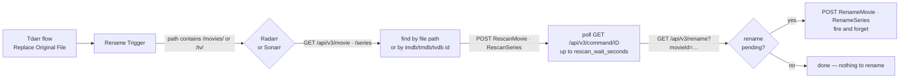

<div align="center">

# Tdarr Radarr/Sonarr Rename Trigger

[](https://github.com/Rovey/tdarr-arr-rename-trigger-plugin/releases/latest)
[](LICENSE)


**Transcoded a file? Radarr and Sonarr rename it, automatically.**

A Tdarr post-processing plugin that tells Radarr or Sonarr to rescan and rename a file the moment Tdarr is done with it — so your filenames stop lying about what's inside them.

[Install](#install) · [Configure](#configure) · [How it works](#how-it-works) · [Troubleshooting](#troubleshooting) · [FAQ](#faq)

</div>

> [!NOTE]
> Unofficial community plugin. Not affiliated with or endorsed by Tdarr, Radarr or Sonarr.

## The problem it solves

Your naming scheme puts the codec in the filename: `Movie (2024) [Remux-2160p][TrueHD Atmos 7.1][VC1].mkv`. Tdarr re-encodes that file to h265 with an AC-3 track — and the filename still says TrueHD and VC-1, because Radarr and Sonarr have no idea anything changed.

Trigger a rename by hand and it often does nothing: the *arr still has the old mediainfo in its database, compares it against the new filename, decides it already matches, and skips. You need a **disk rescan first, then a rename** — in that order, with the rescan actually finished. That's what this plugin does, at the end of your flow, without blocking the Tdarr worker while it waits.

## Features

- **Both services, one node** — routes to Radarr or Sonarr based on the file path, with independent toggles and path filters.
- **Finds the item reliably** — matches the movie file path or the series folder first, then falls back to an IMDB/TMDB/TVDB id from the path, filtered client-side (Radarr silently ignores `?imdbId=`, so server-side filtering returns the wrong title).
- **No stale renames** — triggers a disk-only rescan (`RescanMovie`/`RescanSeries`), waits for it to finish, and only then fires the rename.
- **Never blocks your queue** — the rescan wait is capped (default 15 s) and renames are fire-and-forget; anything left over is caught up on the next run.
- **Keeps your API keys out of the logs** — read them from an env var or a credentials file instead of plugin inputs, which Tdarr dumps into every job report.
- **Tested** — 27 tests, no network, no dependencies to install.

## Install

1. **Copy one file** — `Tdarr_Plugin_rovey_arr_rename_trigger.js` from the [latest release](https://github.com/Rovey/tdarr-arr-rename-trigger-plugin/releases/latest) into your Tdarr plugins folder:

   | Setup | Path |
   | --- | --- |
   | Docker | `/app/server/Tdarr/Plugins/Local/` |
   | Windows | `C:\ProgramData\Tdarr\Plugins\Local\` |
   | Linux | `/opt/tdarr/Plugins/Local/` or `~/.config/Tdarr/Plugins/Local/` |

   Keep the file name exactly as it is — Tdarr loads classic plugins by file name.

2. **Reload plugins** in Tdarr (or restart it). Tdarr installs the plugin's one dependency, `sync-request`, on first run.

3. **Add it to your flow** as a **Classic Plugin** node (`runClassicTranscodePlugin`), select `Tdarr_Plugin_rovey_arr_rename_trigger`, and wire it after *Replace Original File*.

## Configure

### Radarr

| Setting | Type | Default | Description |
| --- | --- | --- | --- |
| `radarr_enabled` | Boolean | `true` | Enable Radarr processing |
| `radarr_path_contains` | String | `/movies/` | Path must contain this string to route to Radarr |
| `radarr_host` | String | `http://localhost:7878` | Full URL to your Radarr instance |
| `radarr_api_key` | String | *(empty)* | Leave empty — see [API keys](#api-keys-without-leaking-them-into-logs) |

### Sonarr

| Setting | Type | Default | Description |
| --- | --- | --- | --- |
| `sonarr_enabled` | Boolean | `true` | Enable Sonarr processing |
| `sonarr_path_contains` | String | `/tv/` | Path must contain this string to route to Sonarr |
| `sonarr_host` | String | `http://localhost:8989` | Full URL to your Sonarr instance |
| `sonarr_api_key` | String | *(empty)* | Leave empty — see [API keys](#api-keys-without-leaking-them-into-logs) |

### Shared

| Setting | Type | Default | Description |
| --- | --- | --- | --- |
| `refresh_first` | Boolean | `true` | Rescan the file from disk before renaming, so the *arr sees the new mediainfo |
| `rescan_wait_seconds` | String | `15` | Max seconds to wait for that rescan before deferring the rename to the next run. `0` = never wait. A text field: anything that isn't a whole number of seconds falls back to `15`, so a typo can't silently mean "never wait" |

Path matching is case-insensitive, and a path can match both services — then both run, Radarr first.

<details>
<summary><b>Example setups</b></summary>
<br>

**Separate movie and TV libraries** — the defaults, with your own hosts:

```text
radarr_path_contains: /movies/     sonarr_path_contains: /tv/
radarr_host: http://192.168.1.100:7878
sonarr_host: http://192.168.1.100:8989
```

**Movies only** — one library, Sonarr off:

```text
radarr_enabled: true      radarr_path_contains: /media/
sonarr_enabled: false
```

**Custom folder names** — anything the path contains works:

```text
radarr_path_contains: /mnt/storage/films/
sonarr_path_contains: /mnt/storage/series/
```

</details>

### API keys without leaking them into logs

> [!WARNING]
> Tdarr writes **every plugin input** into the job report (`Loaded plugin inputs: { ... }`). An API key set as a plugin input therefore sits in plain text in one report per processed file — and an *arr API key grants full read/write access to your whole library.

Leave `radarr_api_key` and `sonarr_api_key` **empty** and provide the keys another way. Resolution order is **input → environment variable → credentials file**:

1. **Environment variables** on the Tdarr node or container: `RADARR_API_KEY` and `SONARR_API_KEY`.
2. **Credentials file** — `arr_credentials.json`, either next to the plugin or at `/app/configs/arr_credentials.json` (Docker):

   ```json
   {
     "radarr_api_key": "your_radarr_api_key",
     "sonarr_api_key": "your_sonarr_api_key"
   }
   ```

   Restrict it: `chmod 600 arr_credentials.json`.

If a key ever went through a plugin input, rotate it: *Radarr/Sonarr → Settings → General → API Key*.

## How it works



1. **Route** — the file path decides whether Radarr, Sonarr, or both handle it.
2. **Look up** — match the movie file path or the series folder; otherwise fall back to an id parsed from the path.
3. **Catch up** — anything a previous run left pending is renamed straight away.
4. **Rescan** — a disk-only rescan, polled once a second until it reports `completed`, bounded by `rescan_wait_seconds`.
5. **Rename** — only if the *arr says a rename is actually pending, and without waiting for it to finish.

Ids are read from the path the way Radarr and Sonarr write them: `tt1234567` → IMDB, `tmdb-12345`/`tmdbid-12345` → TMDB, `tvdb-12345`/`tvdbid-12345` → TVDB.

**API calls used** (v3): `GET /movie` · `GET /series` · `GET /rename?movieId=` · `GET /rename?seriesId=` · `POST /command` (`RescanMovie`, `RescanSeries`, `RenameMovie`, `RenameSeries`) · `GET /command/{id}`.

## Example log output

A file that needed renaming:

```text
[RenameTrigger] Path: /data/media/movies/K3 The Ice Princess (2006) {imdb-tt0812265}/K3 The Ice Princess (2006).mkv
[RenameTrigger] Path contains '/movies/' → Using Radarr
[RenameTrigger] Detected IDs → imdb:tt0812265 tmdb:- tvdb:-
[RenameTrigger] Processing with Radarr at http://172.28.10.12:7878
[RenameTrigger] Looking up movie by file path...
[RenameTrigger] Found movie by file path: K3 The Ice Princess (id=42)
[RenameTrigger] Using movie: K3 The Ice Princess (id=42)
[RenameTrigger] Triggering RescanMovie...
[RenameTrigger] RescanMovie finished with status: completed
[RenameTrigger] RenameMovie fired (201)
```

A series that was already named correctly:

```text
[RenameTrigger] Path contains '/tv/' → Using Sonarr
[RenameTrigger] Matched series folder: Invincible (id=23)
[RenameTrigger] Triggering RescanSeries...
[RenameTrigger] RescanSeries finished with status: completed
[RenameTrigger] ✓ No rename needed.
```

## Troubleshooting

<details>
<summary><b>The plugin doesn't trigger at all</b></summary>
<br>

Check the path filter first — the log prints the path it saw and both filters. The service also has to be enabled, and the node has to sit somewhere the flow actually reaches (after *Replace Original File*, not on a branch that exits early).

</details>

<details>
<summary><b>"movie not found in Radarr" / "series not found in Sonarr"</b></summary>
<br>

The path Tdarr sees must be the path the *arr has. Container mounts are the usual culprit: Tdarr's `/data/media/...` has to be the same file as Radarr's. Failing that, the plugin needs an `{imdb-tt…}`, `{tmdb-…}` or `{tvdb-…}` token in the path to fall back on.

</details>

<details>
<summary><b>API errors, or nothing happens at all</b></summary>
<br>

Check that the host URL is reachable *from the Tdarr container* (not from your desktop), that the key is valid, and that you're on the v3 API — Radarr v3+ and Sonarr v3+.

</details>

<details>
<summary><b>The file still isn't renamed</b></summary>
<br>

Read the last line of the plugin log:

| Line | Meaning |
| --- | --- |
| `✓ No rename needed.` | Radarr/Sonarr genuinely sees nothing to rename — compare your naming scheme against the actual filename |
| `Rescan still busy — rename deferred to a later run.` | The rescan outlived `rescan_wait_seconds`; the rename is caught up on the next run, or raise the wait |
| `Not waiting for the rescan (rescan_wait_seconds = 0) — rename deferred to a later run.` | The wait is switched off, so every rename lands one run late. Set it back to `15` |

`refresh_first` must be on — without the rescan, the *arr compares the new filename against stale metadata and skips. To see what it thinks is pending: `GET /api/v3/rename?movieId=…`.

</details>

## Requirements

- **Tdarr** 2.x (classic plugin, Stage: Post-processing)
- **Radarr** v3.0.0+ / **Sonarr** v3.0.0+ (v3 API)
- **Node.js** 14+ — bundled with Tdarr, nothing to install

## Development

```bash
git clone https://github.com/Rovey/tdarr-arr-rename-trigger-plugin
cd tdarr-arr-rename-trigger-plugin
npm test
```

The suite uses Node's built-in test runner (Node 18+) and needs no `npm install` and no network: `sync-request`, Tdarr's `../methods/lib` and the credentials-file lookup are mocked, including Tdarr's own input casting. Tests live in `tests/`.

## FAQ

<details>
<summary><b>Does it work in Tdarr Flows, or only classic libraries?</b></summary>
<br>

Both. In a Flow, add it through the **Classic Plugin** node (`runClassicTranscodePlugin`).

</details>

<details>
<summary><b>Will it rename my entire library?</b></summary>
<br>

No. It only ever touches the movie or series belonging to the file Tdarr just processed, and only when that *arr reports a pending rename.

</details>

<details>
<summary><b>Why a rescan instead of a refresh?</b></summary>
<br>

`RescanMovie`/`RescanSeries` re-reads the file from disk, which is all the rename needs. `RefreshMovie`/`RefreshSeries` also hits the metadata provider — slower, and pointless here.

</details>

<details>
<summary><b>Why does it block the worker while polling?</b></summary>
<br>

Tdarr's classic plugin API is synchronous, so the plugin must return its result before the worker moves on. That's exactly why the wait is capped by `rescan_wait_seconds` and renames are fire-and-forget.

</details>

## Contributing

Issues and pull requests are welcome — see [CONTRIBUTING.md](CONTRIBUTING.md). Run `npm test` before opening one.

## Version History

The full release history is kept in [CHANGELOG.md](CHANGELOG.md).

## Acknowledgments

Built for [Tdarr](https://tdarr.io/), talks to [Radarr](https://radarr.video/) and [Sonarr](https://sonarr.tv/), and uses [sync-request](https://www.npmjs.com/package/sync-request) for synchronous HTTP.

## License

[MIT](LICENSE) © Rovey
